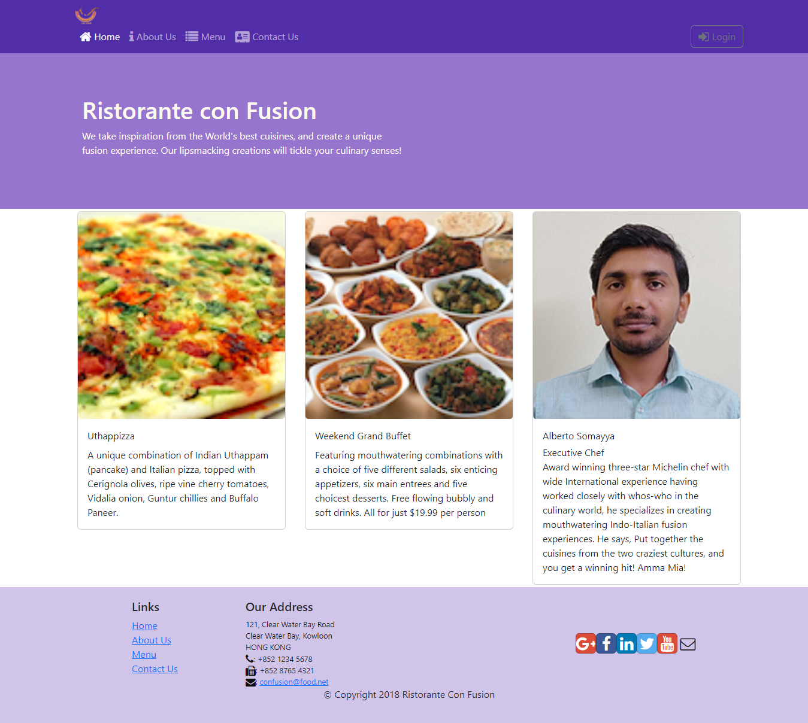
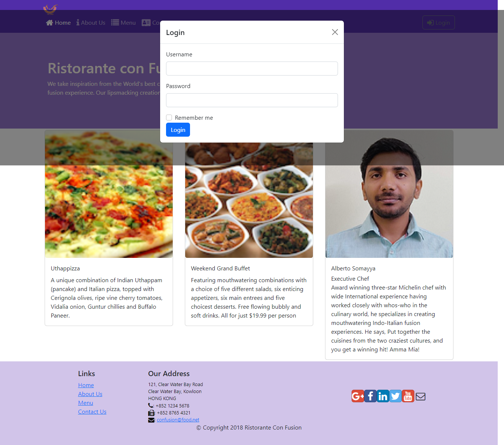
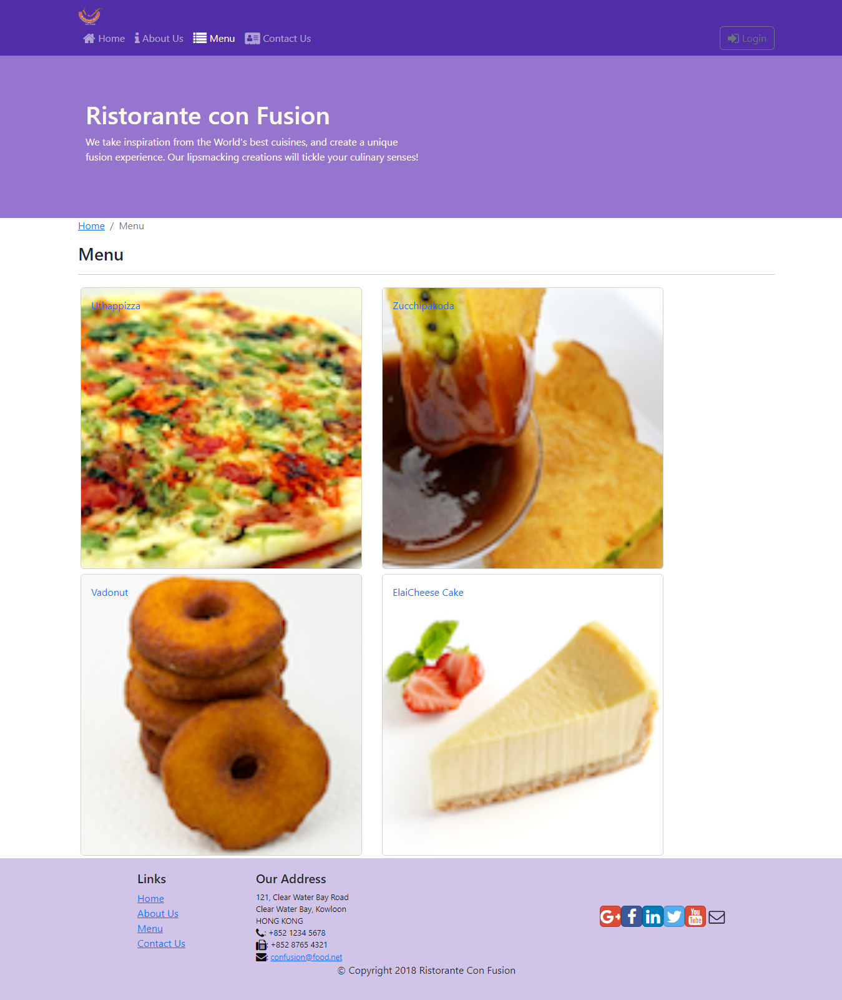
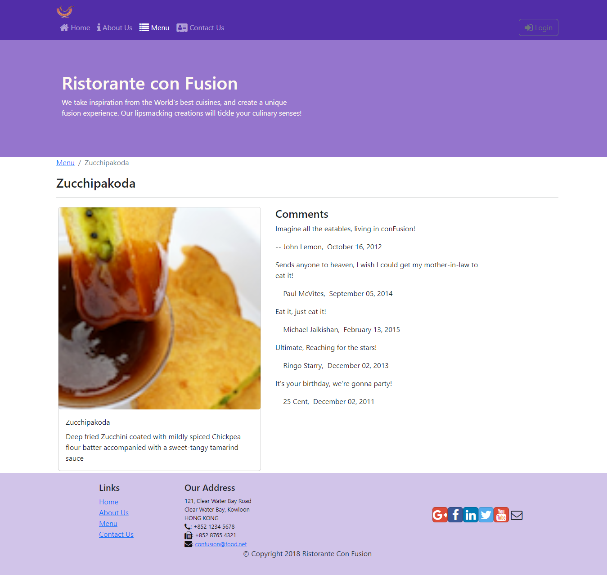
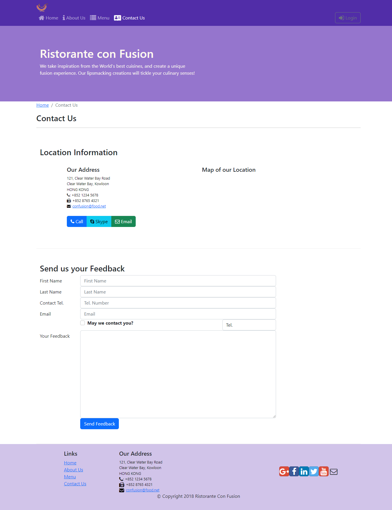
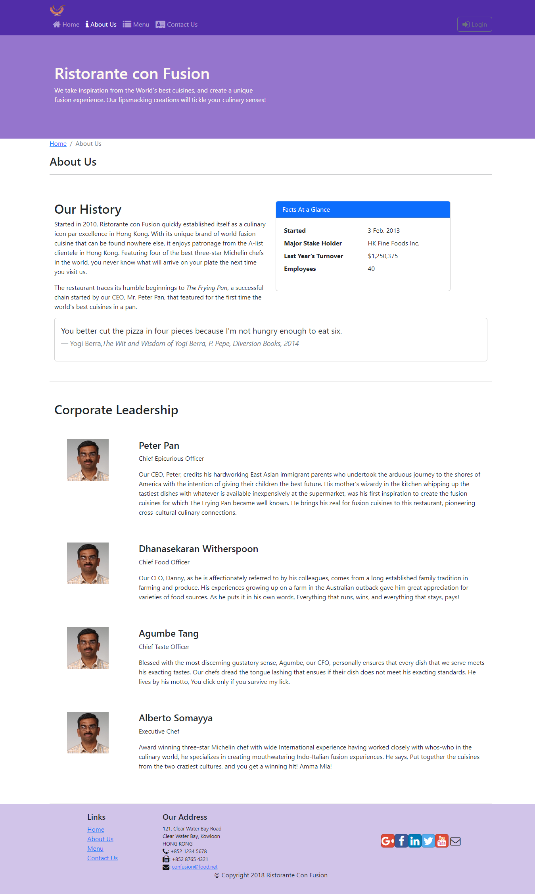

# Restaurant Website(Ongoing)

## Ristorante Con Fusion
Ristorante Con Fusion is a Single-Page ReactJS Web Application (SPA) for an Indian-based Restaurant called Confusion that aims to
show restaurant's available dishes and make users able to choose favorite dishes and comment them. The application is built on the React-Redux Architecture and using RESTful web services architecture.
I have developed this Website(SPA) using ReactJs , Redux Architecture and REST API Client Server Communication.

React has been used as frontend for Component based User Interface.\
NodeJs,ExpressJs and MongoDB has been used for server side development and for database storage.

This Website will facilitates User login facilities, viewing food item list,
about resturant and working chefs and also give comments about a dish.

### Home

### Login Fom

### Menu

### Dish Details

### ContactUs

### AboutUS

This project was bootstrapped with [Create React App](https://github.com/facebook/create-react-app).

## Available Scripts

In the project directory, you can run:

### `npm start`

Runs the app in the development mode.\
Open [http://localhost:3000](http://localhost:3000) to view it in your browser.

The page will reload when you make changes.\
You may also see any lint errors in the console.

### `npm test`

Launches the test runner in the interactive watch mode.\
See the section about [running tests](https://facebook.github.io/create-react-app/docs/running-tests) for more information.

### `npm run build`

Builds the app for production to the `build` folder.\
It correctly bundles React in production mode and optimizes the build for the best performance.

The build is minified and the filenames include the hashes.\
Your app is ready to be deployed!

See the section about [deployment](https://facebook.github.io/create-react-app/docs/deployment) for more information.
